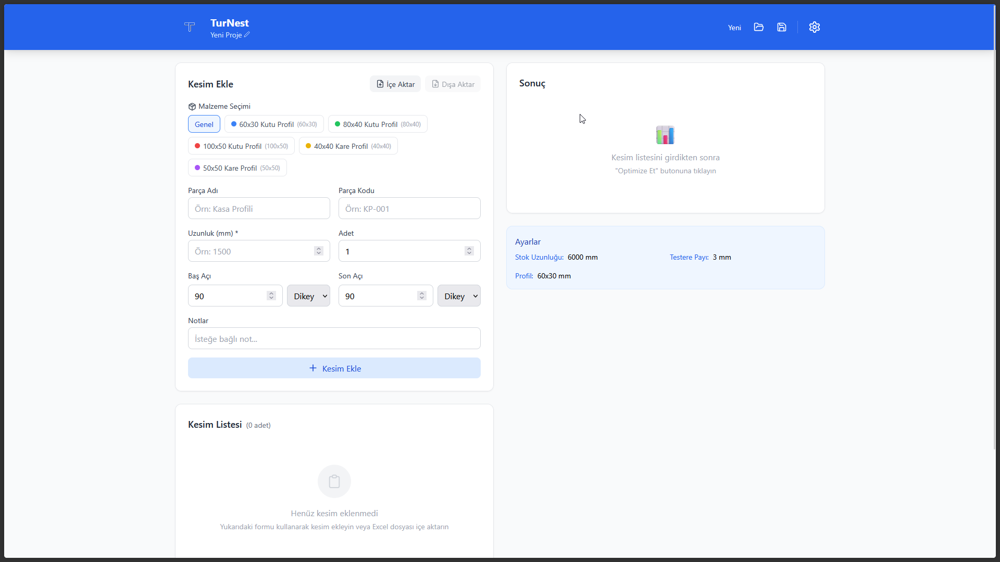
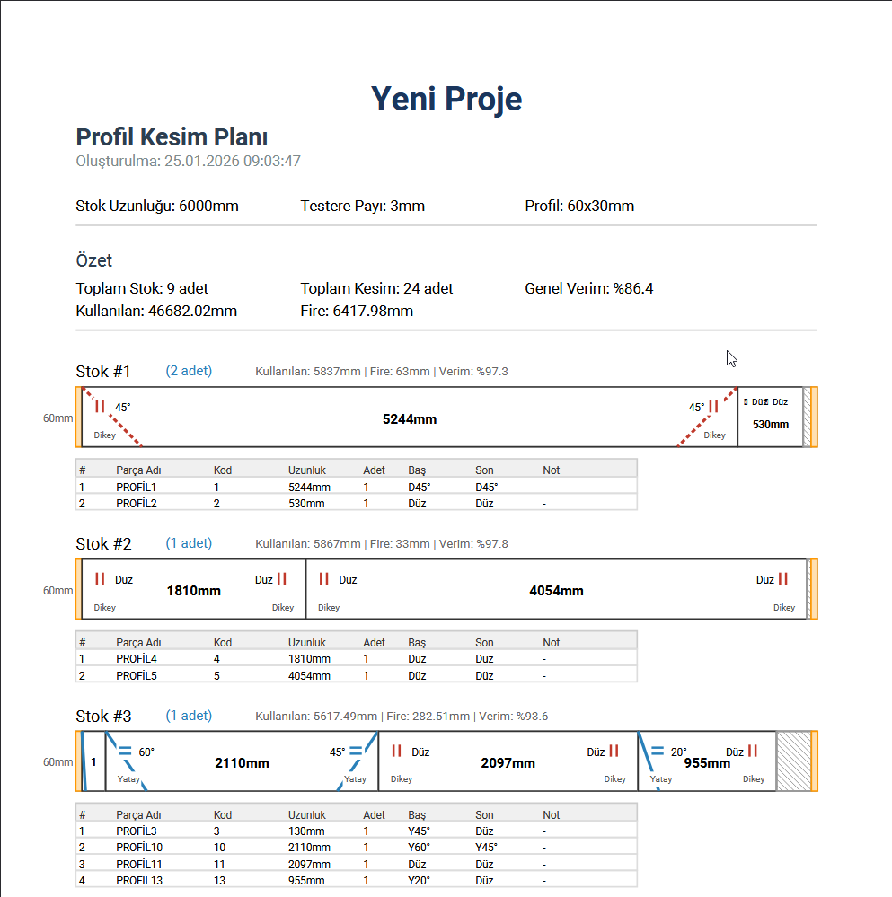

<div align="center">

# 🪚 TurNest

### 1D Cutting Stock Optimization

[](https://hub.docker.com/r/chosenonedevv/turnest)
[](https://nodejs.org/)
[](https://react.dev/)
[](LICENSE)

**Optimize your aluminum and steel profile cutting operations with minimal waste.**

[🚀 Quick Start](#-quick-start) • [📦 Docker Hub](#-docker-hub) • [✨ Features](#-features) • [📖 Documentation](#-documentation)

</div>

---

## 📦 Docker Hub

Pull and run TurNest with a single command:

```bash
docker pull ch0s3n/turnest:latest
docker run -p 3000:3000 chosenonedevv/turnest
```

Then open **http://localhost:3000** in your browser.

### Docker Compose

```yaml
version: '3.8'
services:
  turnest:
    image: ch0s3n/turnest:latest
    ports:
      - "3000:3000"
    restart: unless-stopped
```

```bash
docker-compose up -d
```

---

## 🚀 Quick Start

### Option 1: Docker (Recommended)

```bash
# Clone the repository
git clone https://github.com/ChosenOneDevv/turnest.git
cd turnest

# Build and run
docker-compose up --build
```

### Option 2: Manual Installation

```bash
# Backend
cd backend
npm install
npm run dev

# Frontend (new terminal)
cd frontend
npm install
npm run dev
```

---

## ✨ Features

| Feature | Description |
|---------|-------------|
| 🧮 **Smart Optimization** | First Fit Decreasing (FFD) algorithm for minimal waste |
| 📐 **Angled Cuts** | Support for -90° to 90° angles in horizontal/vertical planes |
| 📄 **PDF Export** | Visual cutting plan with detailed measurements |
| 📊 **Excel Support** | Import/export cutting lists |
| ✂️ **Kerf Calculation** | Automatic saw blade thickness compensation |
| 📏 **Offset Support** | Start/end offset for stock margins |

---

## 🖼️ Screenshots

<div align="center">

| Main Interface | PDF Output |
|:--------------:|:----------:|
|  |  |

</div>

---

## 📖 Documentation

### How It Works

1. **Configure Settings** - Set stock length, kerf width, and profile dimensions
2. **Add Cuts** - Enter length, quantity, angles, and optional notes
3. **Optimize** - Click to calculate the most efficient cutting plan
4. **Export** - Download PDF for workshop use or Excel for records

### Angle Notation

| Notation | Meaning |
|----------|---------|
| `D45°` | 45° angle in vertical plane (from profile height) |
| `Y-30°` | -30° angle in horizontal plane (from profile width) |
| `Düz` | Straight cut (90°) |

### API Endpoints

| Endpoint | Method | Description |
|----------|--------|-------------|
| `/api/health` | GET | Health check |
| `/api/optimize` | POST | Run optimization |
| `/api/pdf` | POST | Generate PDF |
| `/api/excel/export` | POST | Export to Excel |
| `/api/excel/import` | POST | Import from Excel |

---

## 🛠️ Tech Stack

- **Backend:** Node.js 20, Express.js, PDFKit, XLSX
- **Frontend:** React 19, Vite, TailwindCSS, Lucide Icons
- **Container:** Docker with multi-stage build

---

## 🐳 Docker Details

### Image Size
~150MB (optimized multi-stage build)

### Environment Variables

| Variable | Default | Description |
|----------|---------|-------------|
| `PORT` | `3000` | Server port |
| `NODE_ENV` | `production` | Environment mode |

### Health Check

```bash
curl http://localhost:3000/api/health
# {"status":"ok","timestamp":"2024-01-23T10:00:00.000Z"}
```

---

## 📄 License

MIT © [ChosenOneDevv](https://github.com/ChosenOneDevv)

---

<div align="center">

**Made with ❤️ for metalworkers and fabricators**

[⬆ Back to Top](#-turnest)

</div>
